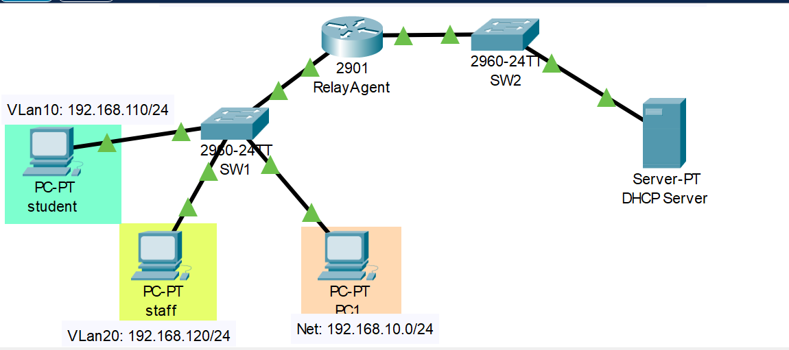
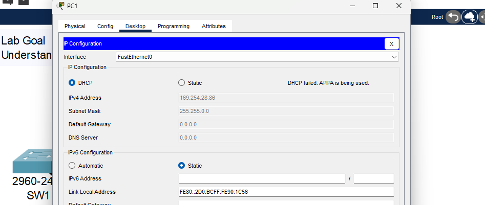
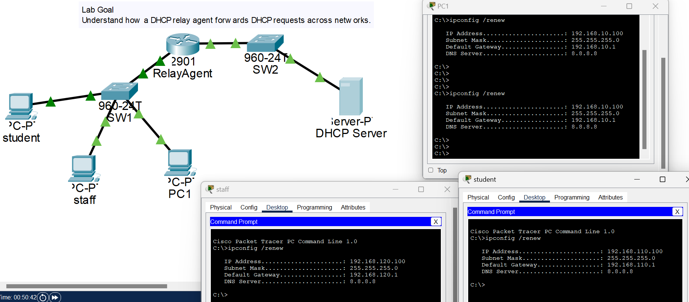

# DHCP Relay Lab – Cisco Packet Tracer

## Overview

This project demonstrates the implementation of DHCP Relay in Cisco Packet Tracer.

The purpose of the lab is to understand how DHCP requests can be forwarded across different network segments using a relay agent. Since routers do not forward broadcast traffic by default, DHCP relay enables clients on one subnet to receive IP addresses from a DHCP server located on another subnet.

---

## Objectives

* Understand why DHCP broadcasts fail across routers
* Configure a router as a DHCP relay agent
* Configure a DHCP server on a separate subnet
* Verify successful IP address assignment
* Observe packet movement using Simulation Mode

---

## Network Topology

Subnet A: 192.168.10.0/24
Subnet B: 192.168.20.0/24

### Addressing Table

| Device      | Interface     | IP Address      |
| ----------- | ------------- | --------------- |
| Router      | G0/0          | 192.168.10.1/24 |
| Router      | G0/1          | 192.168.20.1/24 |
| DHCP Server | Fa0           | 192.168.20.2/24 |
| PC1         | DHCP Assigned | Dynamic         |

---

## Configuration Summary

### Router Configuration

interface g0/0
ip address 192.168.10.1 255.255.255.0
ip helper-address 192.168.20.2
no shutdown
---
#### subinterface configs for Vlans
int g0/0.1
encapsulation dot1q 10
ip add 192.168.110.1 255.255.255.0
!
int g0/0.2
encapsulation dot1q 20
ip add 192.168.120.1 255.255.255.0
---

interface g0/1
ip address 192.168.20.1 255.255.255.0
no shutdown

---

## Testing Procedure

### Before DHCP Relay
---

* Client attempted DHCP request
* Request failed
* Router dropped broadcast traffic
---
### Relay configs
int gig0/0
ip helper-address 192.168.20.2
int gig0/0.1
ip helper-address 192.168.20.2
int gig0/0.1
ip helper-address 192.168.20.2

### After DHCP Relay

* Router forwarded DHCP request
* Server processed request
* Client successfully obtained IP address
---

---

## Packet Flow

Client → DHCP Discover

Router (Relay Agent)

DHCP Server → DHCP Offer

Router

Client → DHCP Request

Router

DHCP Server → DHCP ACK

Router

Client receives IP address

---

## Screenshots

Screenshots are available in the `/screenshots` directory.

---

## Key Takeaways

* Routers block broadcast traffic by default.
* DHCP Discover messages are broadcasts.
* DHCP relay uses `ip helper-address`.
* A centralized DHCP server can serve multiple subnets.

---

## Author

Jonathan Oyo
